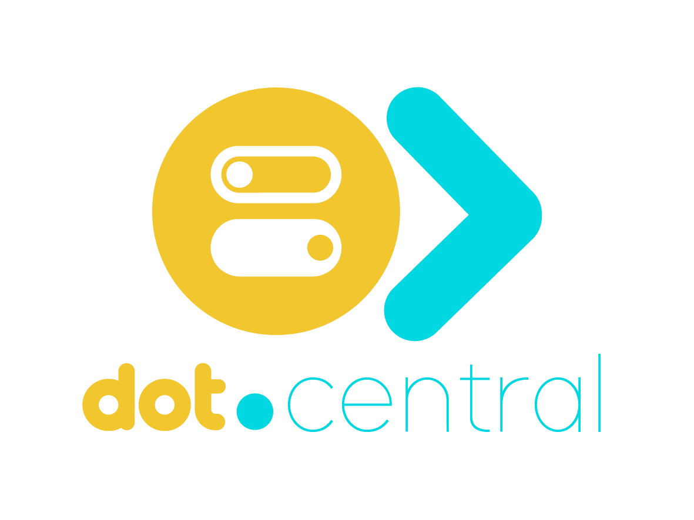

<div align="center">



<h1>Dot.Central</h1>

<p>AI agent hub — create, configure, and converse with specialised AI agents powered by Claude.</p>

[](https://php.net)
[](https://laravel.com)
[](https://livewire.laravel.com)
[](https://postgresql.org)
[](https://anthropic.com)
[](tests/)
[](LICENSE)

</div>

---

## Overview

Dot.Central is the AI agent hub in the Dot ecosystem. Build specialised agents with custom system prompts, equip them with skills, and hold multi-turn conversations with full history. Every token consumed is logged for usage analytics and cost tracking.

---

## Features

- **Agent builder** — define system prompts, model, capabilities, and skill assignments
- **Agent skills** — composable skill registry that agents can invoke during conversations
- **Multi-turn conversations** — persistent conversation history with role tracking (user/assistant)
- **AgentChat Livewire** — real-time streaming chat interface with send/new conversation actions
- **Token usage logging** — input tokens, output tokens, and model recorded per message
- **Mock fallback** — works without `ANTHROPIC_API_KEY` for local development
- **Ecosystem SSO** — authenticate from InfoDot with a single click

---

## Architecture

```php
// AgentChatService handles the full Claude API call
public function chat(Conversation $conversation, string $userMessage, int $userId): ?string
{
    // 1. Persist user message
    // 2. Build history from conversation.messages
    // 3. Call Anthropic API with agent's system_prompt
    // 4. Persist assistant reply
    // 5. Log token usage to AgentUsageLog
}
```

---

## Domain Model

```
Agent (system_prompt, model, capabilities JSON)
    ← agent_agent_skill → AgentSkill
    → Conversations → Messages (role: user|assistant)
    → AgentUsageLogs (input_tokens, output_tokens, model)
```

---

## Tech Stack

| Layer | Technology |
|---|---|
| Framework | Laravel 12 + PHP 8.4 |
| Frontend | Livewire 3 + Alpine.js + Tailwind CSS |
| Auth | Jetstream 5 + Sanctum (ecosystem SSO) |
| Database | PostgreSQL 16 (shared infodot instance) |
| AI | Anthropic Claude API (claude-sonnet-4-6 default) |
| WebSockets | Laravel Reverb |

---

## Quick Start

```bash
git clone https://github.com/sakhileb/Dot.Central.git && cd Dot.Central
composer install && npm install
cp .env.example .env && php artisan key:generate
# Add ANTHROPIC_API_KEY to .env (optional — mock fallback works without it)
php artisan migrate && npm run dev & php artisan serve
```

```bash
bash bin/test.sh   # 37 passing, 0 failed, 7 skipped
```

---

## Part of the Dot Ecosystem

Dot.Central connects to [InfoDot](https://github.com/sakhileb/InfoDot) — the central hub. Log in to InfoDot once and navigate here without re-authenticating via `/auth/ecosystem`.

---

MIT — © SK Digital / BluPin Incorporated
