<div align="center">



<br /><br />

**Create, configure, and converse with specialised AI agents powered by Claude.**

<br />

   

<br /><br />

**Part of the [InfoDot Ecosystem](https://github.com/sakhileb/InfoDot)** &nbsp;·&nbsp; `central.infodot.app`

</div>

---

## What is Dot.Central?

Dot.Central is the AI command centre in the InfoDot ecosystem. Teams create specialised Claude-powered agents with custom system prompts, knowledge bases, and tool integrations — then converse with them directly or route tasks from other Dot platforms through them.

## Core Features

- Agent builder — system prompt, persona, and tool configuration
- Conversation interface with streaming responses
- Knowledge base upload — ground agents on internal documents
- Multi-agent routing — chain agents for complex workflows
- Usage and cost tracking per agent and per team member
- Conversation history with search and export
- API endpoint per agent for external integrations
- Ecosystem SSO from InfoDot hub

## Domain Models

- **CentralAgent** — Claude-backed AI persona
- **CentralConversation** — full message thread
- **CentralMessage** — individual turn in a conversation
- **AgentKnowledge** — uploaded context document

## Tech Stack

| Layer | Technology |
|---|---|
| Framework | Laravel 12 |
| Language | PHP 8.4 |
| Frontend | Livewire 3 · Alpine.js 3 · Tailwind CSS |
| Database | PostgreSQL 16 (shared across ecosystem) |
| Realtime | Laravel Reverb |
| Auth | Laravel Sanctum (InfoDot SSO) |
| AI | Anthropic Claude (`claude-sonnet-4-6`) |
| Storage | AWS S3 / Local (Flysystem) |
| Search | Laravel Scout · Meilisearch |
| Queue | Redis · Laravel Horizon |

## Quick Start

```bash
git clone https://github.com/sakhileb/Dot.Central.git
cd Dot.Central
cp .env.example .env
composer install
npm install && npm run build
php artisan key:generate
php artisan migrate
php artisan serve
```

> **Ecosystem SSO:** Set `DB_*` env vars to the shared InfoDot PostgreSQL instance and `APP_URL=https://central.infodot.app`. Users authenticated through InfoDot gain access automatically via Sanctum handoff tokens.

## Ecosystem

**Dot.Central** is one of **21 platforms** in the InfoDot ecosystem, connected via shared PostgreSQL and Sanctum SSO. Visit [InfoDot](https://github.com/sakhileb/InfoDot) to explore the full platform map.

## License

MIT © [SK Digital / BluPin Incorporated](https://github.com/sakhileb)
